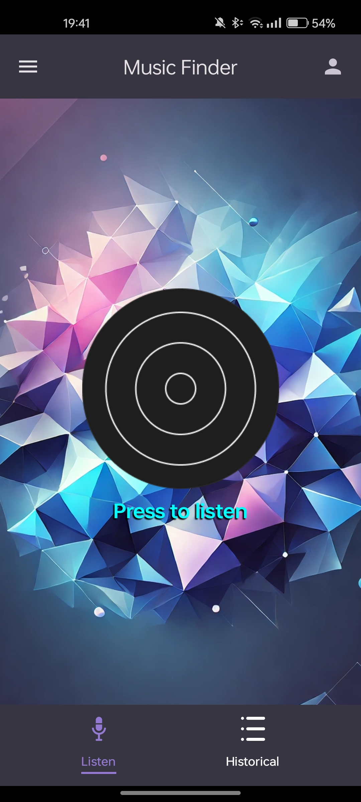

# MusicFinder 🎵

MusicFinder es una aplicación móvil para Android que permite reconocer canciones grabando un fragmento de audio. Este proyecto es un desarrollo personal con el objetivo de aprender y practicar **Kotlin** y **Jetpack Compose**, explorando también el uso de APIs de reconocimiento de música.

---

## 🚀 Características

- 🎤 **Reconocimiento de canciones** a través de una grabación de audio.
- 🎨 **Interfaz moderna y dinámica** creada con **Jetpack Compose**.
- 🎚 **Cambio de tema** entre modo claro y oscuro.
- 📜 **Historial de canciones reconocidas** para acceder fácilmente a búsquedas anteriores.
- 🌐 **Integración con Spotify**, permitiendo abrir las canciones directamente en la app.
- 🎛 **Ajustes personalizados**, incluyendo selección de idioma y API Key para la autenticación.

---

## 🛠 Tecnologías utilizadas

- **Kotlin**: Lenguaje principal para el desarrollo de la app.
- **Jetpack Compose**: Framework declarativo para la interfaz de usuario.
- **MediaRecorder**: Para la grabación de audio.
- **Retrofit**: Para realizar llamadas a la API de reconocimiento de música.
- **Coil**: Para la carga eficiente de imágenes.
- **SharedPreferences**: Para el almacenamiento de datos locales.
- **Security Crypto**: Para almacenar credenciales de forma segura.

---

## 📸 Capturas de pantalla



---

## 📦 Instalación y ejecución

1. Clona este repositorio:
   ```sh
   git clone https://github.com/raulgarvicascos/musicfinder.git
   ```
2. Abre el proyecto en **Android Studio**.
3. Conéctalo a un emulador o dispositivo físico.
4. Ejecuta la aplicación.

---

## 🔑 Configuración de la API

Para usar la funcionalidad de reconocimiento de música, necesitas una API Key de **AudD** u otro proveedor compatible. Sigue estos pasos:

1. Obtén una API Key en [AudD](https://audd.io/).
2. Guarda la API Key en la configuración de la app desde los ajustes.

---

## 🚧 Estado del proyecto

Este es un proyecto en desarrollo, creado con fines educativos. Algunas funcionalidades pueden no estar completamente optimizadas o pueden ser mejoradas en futuras versiones.

---

## 📜 Licencia

Este proyecto está bajo la licencia **MIT**. Siéntete libre de explorar, modificar y contribuir.

---

## 📬 Contacto

Si tienes preguntas o sugerencias, puedes escribirme en [GitHub](https://github.com/tu-usuario) o por correo electrónico.

¡Gracias por visitar este proyecto! 🎶🚀

---
# DEMO

[🎥 Ver video de demostración](app/src/main/res/raw/video_demo_app.mp4)


